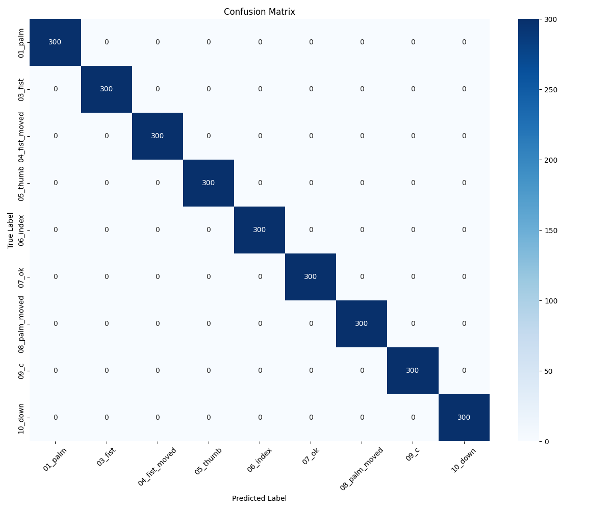
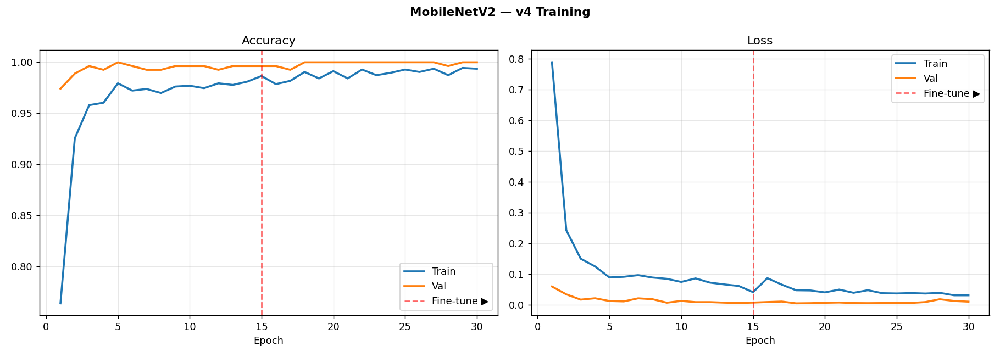
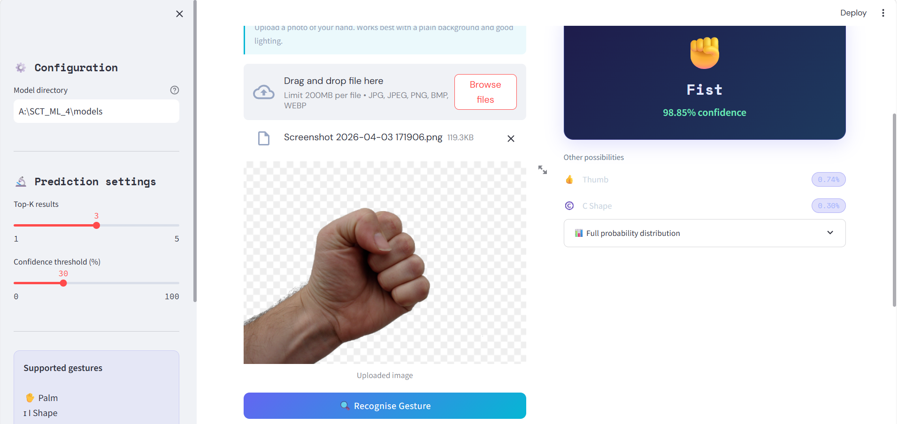
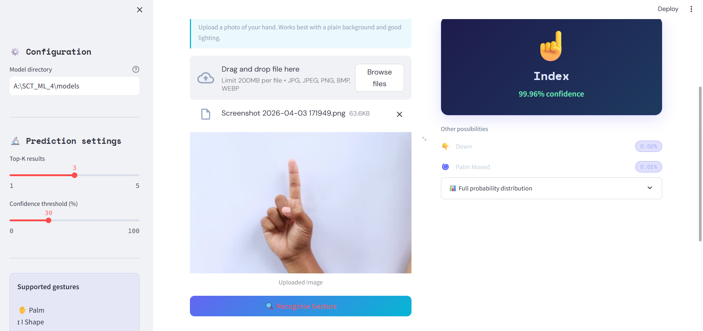
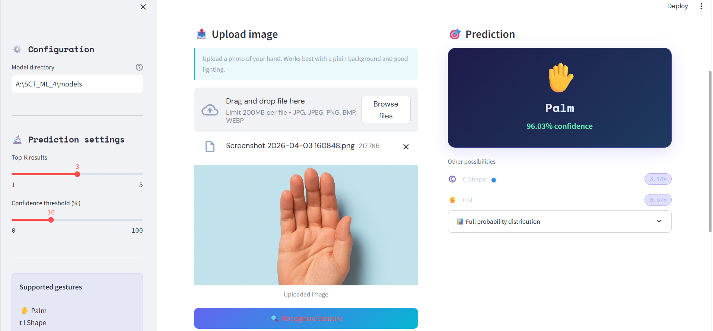
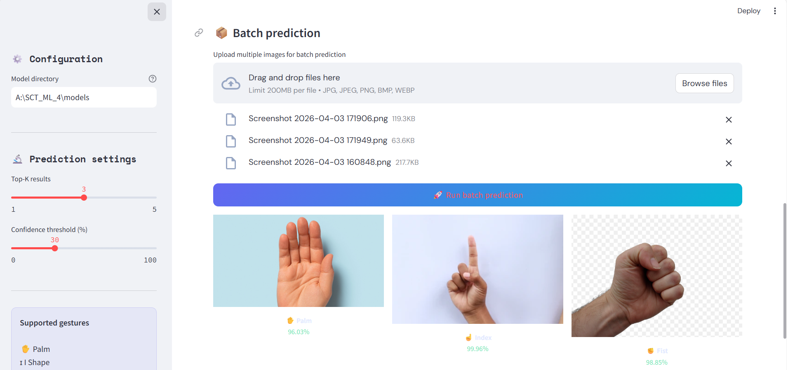

# ✋ Hand Gesture Recognition (Deep Learning)

<div align="center">


</div>

## 📌 Overview
A deep learning model to classify **10 hand gestures** using **MobileNetV2 + Transfer Learning**.  
Includes a **Streamlit web app** for real-time predictions.

**Accuracy: 95%+** | **Gestures: 10** | **Inference: 30–50ms**

## 🚀 Features
- ✅ 10 gesture classes (Palm, Fist, Thumb, OK, Index, etc.)
- ✅ Real-time prediction (webcam + image upload)
- ✅ Streamlit web interface
- ✅ Top-K predictions with confidence scores
- ✅ Batch image processing
- ✅ Confusion matrix & training graphs

## 🖐️ Gestures

| Emoji | Gesture | Emoji | Gesture |
|------|--------|------|--------|
| ✋ | Palm | 👍 | Thumb |
| ✊ | Fist | ☝️ | Index |
| 👊 | Fist Moved | 👌 | OK |
| 🤞 | I Shape | 🖐️ | Palm Moved |
| 🤏 | C Shape | 👇 | Down |

## 📊 Results

| Metric | Score |
|--------|------|
| Test Accuracy | 95%+ |
| Validation Accuracy | 97–99% |
| Model Size | ~10 MB |

### Confusion Matrix


### Training History



## 🖥️ Demo

| Interface | Prediction |
|----------|-----------|
|  |  |

| Camera Mode | Batch Processing |
|------------|------------------|
|  |  |

---

## 🏗️ Project Structure

SCT_ML_4/
├── data/
│   └── leapGestRecog/
├── models/
│   ├── gesture_model.keras
│   ├── label_encoder.pkl
│   ├── confusion_matrix.png
│   └── training_history.png
├── screenshots/
│   ├── app_interface.png
│   ├── first.png
│   ├── second.png
│   ├── third.png
│   └── fourth.png
├── app.py
├── train.py
├── utils.py
├── requirements.txt
└── README.md

## ⚡ Setup

```bash
# Clone repository
git clone https://github.com/aksharadileep/SCT_ML_4.git
cd SCT_ML_4

# Install dependencies
pip install -r requirements.txt
📥 Dataset

Dataset is not included due to size.

Download from Kaggle:
🔗 https://www.kaggle.com/datasets/gti-upm/leapgestrecog

Extract to:
data/leapGestRecog/
Dataset Structure
leapGestRecog/
├── 00/01_palm/
├── 00/02_I/
├── ...
└── 09/10_down/

🧠 Train Model
python train.py
Training Phases
Phase 1: Head training (20 epochs, LR: 1e-3)
Phase 2: Fine-tuning (15 epochs, LR: 1e-5)
🌐 Run App
streamlit run app.py

🛠️ Tech Stack

| Technology           | Purpose              |
| -------------------- | -------------------- |
| TensorFlow / Keras   | Deep learning        |
| MobileNetV2          | Pre-trained backbone |
| OpenCV               | Image processing     |
| Streamlit            | Web interface        |
| Scikit-learn         | Label encoding       |
| Matplotlib / Seaborn | Visualization        |


🤝 Connect

GitHub: https://github.com/aksharadileep
LinkedIn: https://linkedin.com/in/akshara-dileep-005-
Email: aksharadileee16@gmail.com

🙌 Acknowledgments

SkillCraft Technology — Internship Task 4
Kaggle — Dataset
